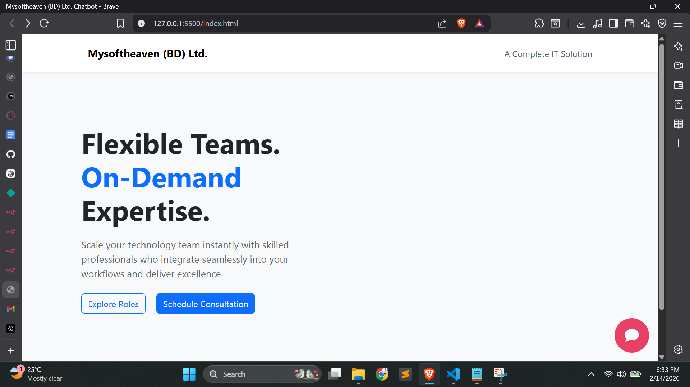
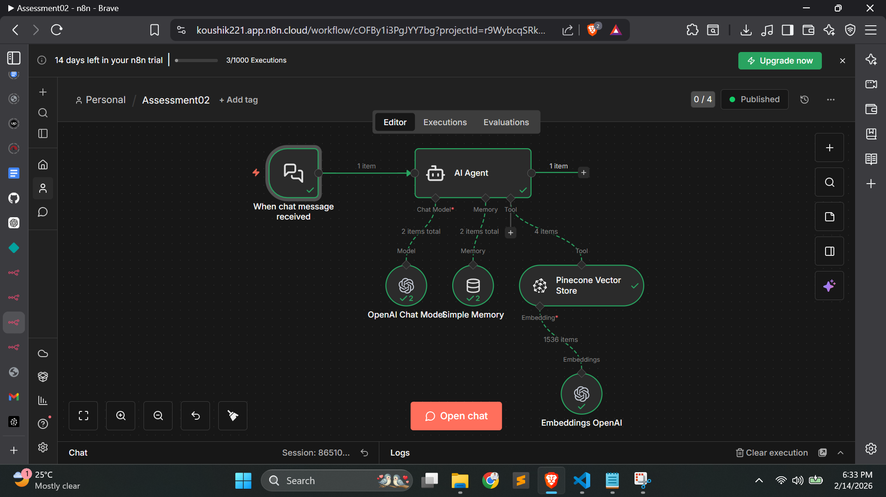

# 🤖 AI-Powered Company Assistant Website

A sleek, minimalistic website featuring an intelligent AI chatbot. This project integrates a modern frontend with a sophisticated AI backend using **n8n** and **Pinecone** to provide accurate, company-specific information.


---

## 🌟 Features

* **Minimalist Design:** Built with a "less is more" philosophy for a clean user experience using HTML, Bootstrap, and Custom CSS.
* **Context-Aware Chatbot:** Powered by an AI Agent that only answers questions based on the company profile stored in Pinecone.
* **Smart Filtering:** The agent is programmed to ignore or politely decline non-relevant queries (out-of-scope questions) to maintain a professional tone.
* **Vector Search:** Uses Pinecone as a vector database for high-speed, relevant information retrieval.
* **Seamless Automation:** n8n handles the entire workflow from user message to AI response.

---

## 📸 Screenshots & Workflow

### 🖥️ Website Preview

*A look at the minimalistic UI design.*

.png)
*A look at the minimalistic UI design With AI-Chatbot.*

### ⚙️ n8n Workflow

*The backend automation logic connecting the Chat Trigger, AI Agent, and Pinecone.*

.png)
*The backend automation logic For Data Preprocessing connecting Google Drive, Embeddings OpenAI, Data Loader, Text Spliter and Pinecone.*

---

## 🛠️ Tech Stack

**Frontend:**
* **HTML5:** Core structure.
* **Bootstrap 5:** Responsive layout components.
* **Custom CSS:** Unique minimalistic styling.
* **JavaScript:** Managing the chat interface and fetching data from n8n.

**Backend & AI:**
* **n8n:** Workflow automation & AI Agent orchestration.
* **Pinecone:** Vector Database for company data storage.
* **AI Model:** (OpenAI/Claude) via n8n AI Agent.

---

## 🚀 How It Works

1.  **Data Storage:** Company profile information is converted into vectors and stored in **Pinecone**.
2.  **User Interaction:** A user types a message in the website's chatbot.
3.  **n8n Processing:** The message is sent to an n8n webhook which triggers the AI Agent.
4.  **Information Retrieval:** The Agent queries Pinecone to find relevant facts about the company.
5.  **Response Generation:** If the query matches company data, the AI answers. Otherwise, it follows the instruction to ignore the message.

---

## 📁 Project Structure

```text
|── images 
    |──website-preview.png # Screenshot of the UI
    |──website-preview(1).png # Screenshot of the UI With AI Chatbot
    |──n8n-workflow.png # Screenshot of the Workflow With AI-Agent
    |──n8n-workflow(1).png # Screenshot of the Workflow With Data Pre-Processing
├── index.html          # Main website file
└── README.md           # Project documentation